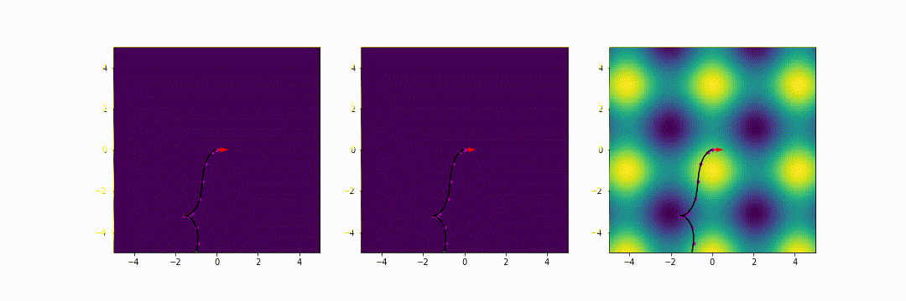

# Informative path planning for a mobile robot using optimal control and Bayesian optimisation

The notebooks in this repo illustrate optimal control and using relaxation.

[This notebook](Bayes_opt.ipynb) provides a basic Bayesian optimisation example.

The basic mathematical formulation to these problems is available [in this notebook](Mathematical%20formulation.ipynb). All of the scripts below rely on the surrogate.py GP model taken from [here](https://github.com/jacojvr/RbfX), which has functionality to calculate the derivatives of a GP.

[This notebook](optimal_point2point.ipynb) implements a basic point to point control example for a moble robot in an environment with obstacles.

[This notebook](point_2_point_exploration.ipynb) implements an optimal control formulation to explore an unknown space with the final state selected using a dirty heuristic.

This can produce navigation strategies that can trade-off exploration and exploitation.

[This notebook](free_state_exploration.ipynb) implements an optimal control formulation to explore an unknown space with free final state.

